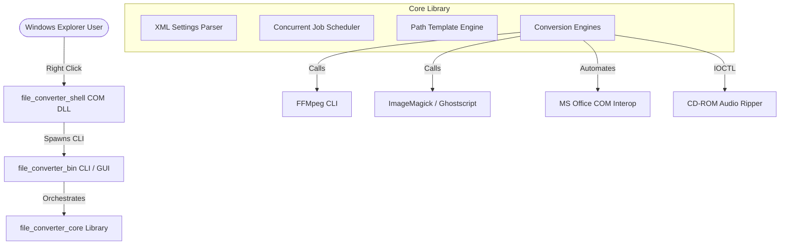
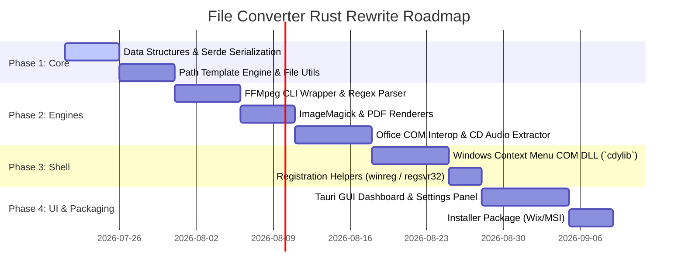

# Rust Rewrite Plan: File Converter

This document outlines the detailed architecture, technology stack, and implementation plan for rewriting the C# **File Converter** project in **Rust** to achieve **100% feature parity**, native Windows integration, and high performance.

---

## 1. Project Goals & Architecture

To achieve 100% feature parity, the Rust implementation will replicate all behaviors of the C# application, including the Windows Explorer context menu, XML configuration format, concurrent conversion scheduler, clipboard integration, file timestamp matching, and third-party media engine invocations (FFMpeg, ImageMagick, Office COM, CD extraction).

We will structure the rewrite as a **Rust Cargo Workspace** consisting of three main crates:



### Workspace Crate Breakdown

1. **`file_converter_core` (Library Crate)**:
   - Shared business logic, settings serialization, path template generation, clipboard manipulation, and file-time synchronization.
   - Core conversion engines (`FfmpegEngine`, `ImageMagickEngine`, `OfficeComEngine`, `CdaExtractionEngine`).
   - Thread pool executor / conversion job runner.
2. **`file_converter_shell` (Dynamic Library Crate - `cdylib`)**:
   - A native COM DLL implementing `IShellExtInit` and `IContextMenu` interfaces.
   - Reads the user XML settings, parses file extensions of selected files, checks preset compatibility, and constructs dynamic context submenus.
   - Spawns the main executable (`file_converter_bin`) passing `--conversion-preset` and selected file arguments (supporting temporary file arguments for command line size limits).
3. **`file_converter_bin` (Binary Crate)**:
   - Application entrypoint handling CLI arguments (`--settings`, `--conversion-preset`, `--input-files`, `--verbose`, etc.).
   - Launches the GUI dashboard built with **Tauri v2** to display conversion progress, log diagnostics, customize settings, and configure presets.

---

## 2. Recommended Technology Stack

| Feature in C# | Equivalent Rust Library / Strategy | Rationale |
| :--- | :--- | :--- |
| **GUI Framework** (WPF) | **Tauri v2** (HTML5 / Vanilla CSS / TypeScript) | Matches the premium UI requirements. Permits glassmorphism, smooth animations, responsive grids, and runs inside a lightweight WebView2 container. |
| **Shell Extension** (SharpShell) | **`windows` / `windows-sys`** (COM interfaces) | Rust library to implement COM interfaces (`IContextMenu`, `IShellExtInit`). Compiled as `cdylib` and registered via `regsvr32`. |
| **XML Serialization** (`XmlSerializer`) | **`serde` + `quick-xml`** | High-performance XML parser and deserializer compatible with Serde, providing direct mapping to C# classes. |
| **Registry Access** (`Registry`) | **`winreg`** | Crate to query and update the Windows registry (e.g. `Software\FileConverter` path and settings). |
| **FFMpeg Integration** (`Process.Start`) | **`std::process::Command` + `regex`** | Launches `ffmpeg.exe` and streams stderr asynchronously. Replicates custom preset commands and parses progress parameters via regex. |
| **ImageMagick** (`Magick.NET`) | **`magick-rust`** or **`magick` CLI** | C-wrapper bindings (`magick-rust`) to access `MagickWand` API, or direct command line execution for conversion and PDF super-sampling. |
| **PDF Rendering** (Ghostscript) | **`gswin64c.exe`** or **`pdfium-render`** | For PDF-to-image extraction. Can bind to pdfium for speed or call Ghostscript CLI to maintain parity. |
| **Office Automation** (`NetOffice`) | **`windows::Win32::System::Com` (IDispatch)** | Performs COM Automation for MS Word, Excel, and PowerPoint using IDispatch interface calls. |
| **CD Audio Extraction** (`Ripper.dll`) | **`windows::Win32::System::Ioctl`** | Performs low-level Win32 SCSI Pass-Through / IOCTL commands (`IOCTL_CDROM_READ_TOC`, etc.) to read raw audio CD sectors. |
| **Clipboard Files Copy** (`Clipboard`) | **`clipboard-win`** | Windows clipboard manipulation supporting `CF_HDROP` file drop formatting. |
| **File Timestamps** (`File.SetLastWriteTime`) | **`filetime`** | Crate to query and update creation/access/modification file timestamps with nanosecond precision. |

---

## 3. Detailed Data Models

### Settings Configuration (XML Parity)
The XML serialization must strictly match the C# schema. Using `serde-xml-rs` or `quick-xml` macro annotations, we define:

```rust
use serde::{Deserialize, Serialize};

#[derive(Debug, Serialize, Deserialize, PartialEq)]
#[serde(rename_all = "PascalCase")]
pub struct Settings {
    #[serde(attribute = "SerializationVersion")]
    pub serialization_version: i32,
    pub maximum_number_of_simultaneous_conversions: usize,
    pub exit_application_when_conversions_finished: bool,
    pub duration_between_end_of_conversions_and_application_exit: f32,
    pub check_upgrade_at_startup: bool,
    pub application_language_name: String,
    pub copy_files_in_clipboard_after_conversion: bool,
    pub hardware_acceleration_mode: HardwareAccelerationMode,
    
    #[serde(rename = "ConversionPreset")]
    pub conversion_presets: Vec<ConversionPreset>,
}

#[derive(Debug, Serialize, Deserialize, PartialEq, Clone)]
#[serde(rename_all = "PascalCase")]
pub struct ConversionPreset {
    #[serde(attribute = "Name")]
    pub name: String,
    #[serde(attribute = "OutputType")]
    pub output_type: OutputType,
    #[serde(attribute = "IsDefaultSettings")]
    pub is_default_settings: bool,
    
    #[serde(rename = "InputTypes")]
    pub input_types: Vec<String>,
    pub input_post_conversion_action: InputPostConversionAction,
    
    #[serde(rename = "Settings")]
    pub settings: Vec<PresetSetting>,
    pub output_file_name_template: String,
}

#[derive(Debug, Serialize, Deserialize, PartialEq, Clone)]
pub struct PresetSetting {
    #[serde(attribute = "Key")]
    pub key: String,
    #[serde(attribute = "Value")]
    pub value: String,
}
```

---

## 4. Implementation Phase Plan



### Phase 1: Core Infrastructure
*   **XML Parser**: Write tests against the existing C# `Settings.default.xml` and `%LocalAppData%\FileConverter\Settings.user.xml` to ensure Serde deserializes and serializes with byte-for-byte structural equivalence.
*   **Path Template Engine**: Replicate the placeholder substitution engine:
    *   Replace `(path)`, `(p)`, `(filename)`, `(f)`, `(outputext)`, `(o)`, `(inputext)`, `(i)`.
    *   Support dynamic indices: `(n:i)` (current file index) and `(n:c)` (total conversion count).
    *   Support date formatting patterns like `(d:yyyy-MM-dd_HH-mm-ss)`.
    *   Preserve system directories: `(p:documents)`, `(p:music)`, `(p:videos)`, `(p:pictures)`.
*   **Unique File Names**: Implement directory checking and unique sequence name generation (e.g. `file (2).png`).
*   **File Time Preserver**: Write a file utility using the `filetime` crate that reads the creation, modification, and access timestamps from the source file and applies them to output files post-conversion.

### Phase 2: Media Conversion Engines
1.  **FFMpeg Engine**:
    *   Build arguments for codec setups: libx264 (MP4/MKV), libmp3lame (MP3), vorbis (OGG/OGV), vp9 (WEBM), aac (AAC), pcm_s16le (WAV).
    *   Support Hardware Acceleration translation: CUDA (`-hwaccel cuda`) and AMF (`h264_amf`).
    *   Spawn `ffmpeg.exe` via `std::process::Command`. Use regex to parse FFMpeg stderr output line-by-line:
        *   `Duration: (\d+):(\d+):(\d+)\.(\d+)` to establish total stream length.
        *   `size=\s*(\d+).*time=(\d+):(\d+):(\d+)\.(\d+)` to calculate real-time percentage progress.
2.  **ImageMagick Engine**:
    *   Invoke ImageMagick CLI or load dynamic library using `magick-rust`.
    *   Implement image properties: Scaling, rotation, color formatting, maximum size caps, and rounding dimensions to the nearest power of 2 (crucial for ICO files).
3.  **Office COM Automation**:
    *   Establish COM connection via `IDispatch` or load automation wrappers.
    *   Open documents in silent mode (`Visible = false`).
    *   Automate:
        *   Word: `document.ExportAsFixedFormat(..., wdExportFormatPDF)`
        *   Excel: `workbook.ExportAsFixedFormat(xlTypePDF, ...)`
        *   PowerPoint: `presentation.ExportAsFixedFormat(..., ppFixedFormatTypePDF)`
    *   If destination output format is an image, pipe the intermediate PDF to the PDF-to-image extraction helper.
4.  **CD Audio Extractor**:
    *   Detect CD drives via Win32 drive queries.
    *   Read track sizes and read raw PCM sectors using SCSI Pass-Through direct command requests.
    *   Stream raw data to a temporary wav file, then queue a sub-job conversion.

### Phase 3: Shell Context Menu Integration
*   Write a Rust DLL `file_converter_shell` exporting COM entrypoints: `DllGetClassObject`, `DllCanUnloadNow`, `DllRegisterServer`, `DllUnregisterServer`.
*   Implement `IShellExtInit::Initialize` to capture the selected files list.
*   Implement `IContextMenu::QueryContextMenu` to build the popup menu. Retrieve user settings to render custom presets dynamically with matching icons (load folder icons and app icon resources).
*   Implement `IContextMenu::InvokeCommand` to execute `file_converter_bin.exe`.
    *   If the command-line argument list is long (exceeds 8192 characters), write the file paths to `%TEMP%\file-converter-input-list-[uuid].txt` and pass it via `--input-files`.

### Phase 4: Tauri Frontend Dashboard & Settings
*   **Conversion Window**: Displays progress bars for active files, execution statuses (Queue, Converting, Done, Failed), time indicators, and cancel controls.
*   **Settings Window**: 
    *   TreeView list of presets and directories with drag-and-drop support for sorting.
    *   Visual editors for settings: Audio bitrates, video quality sliders, custom FFMpeg override commands, input categories, post-conversion rules (Archive, Delete, None).
    *   Provide sleek design using Tauri backend and HTML5/CSS3 frontend.

---

## 6. Potential Risks & Mitigation Strategies

1.  **COM Interface Complexity in Rust**:
    *   *Risk*: Implementing native COM interfaces (`IContextMenu`, `IShellExtInit`) in Rust without a wrapper is verbose and error-prone.
    *   *Mitigation*: Use the `windows` crate which provides predefined bindings and helper macros for Win32 COM, or create a thin C++ wrapper DLL that handles COM registration and delegates back to a shared Rust core DLL.
2.  **Office COM Automations blocking on pop-ups**:
    *   *Risk*: Automating MS Office sometimes hangs if a modal popup (e.g. "Save changes" or dialogs) appears.
    *   *Mitigation*: Ensure silent mode is strictly configured (`Visible = false`, `DisplayAlerts = false`) and run Office exports inside a dedicated watchdog thread that terminates the process if a timeout is reached.
3.  **Direct CD Audio sector reading drivers**:
    *   *Risk*: Low-level SCSI IOCTL calls require specific user privileges and direct drive handles which might fail on some security profiles.
    *   *Mitigation*: Verify access at startup. If IOCTL fails, fall back to invoking an open-source command line CD ripper helper tool (like `icedax`) bundled inside the application middleware directory.
4.  **Ghostscript Dependencies**:
    *   *Risk*: Ghostscript requires license compliance and local installation for PDF conversions via ImageMagick.
    *   *Mitigation*: Use a pre-compiled, static library version of `pdfium` via `pdfium-render` for PDF-to-Image rendering. This removes the Ghostscript installation dependency entirely, dramatically reducing installer size and complexity.
